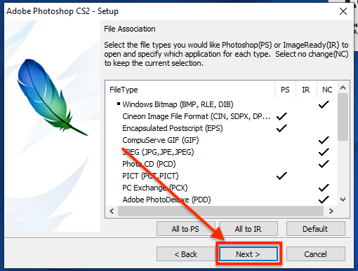
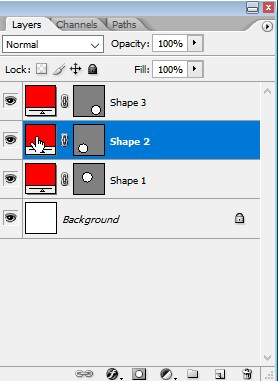
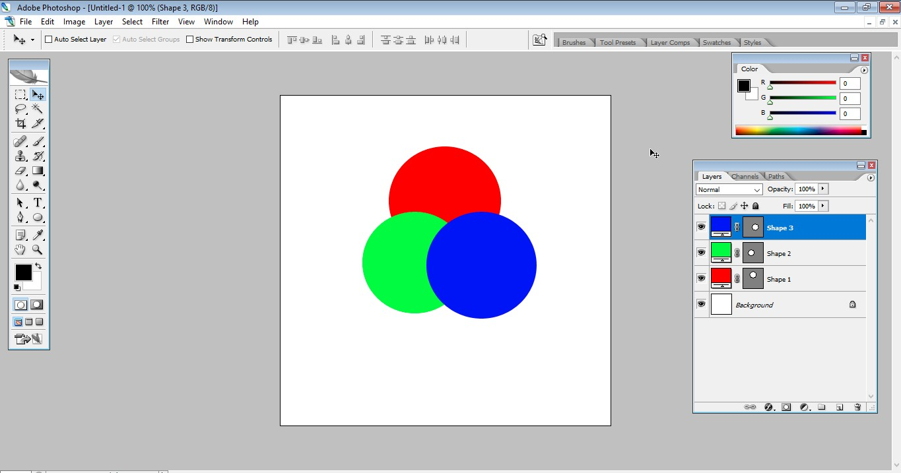

# Инструкция к домашнему заданию 7
## Часть 1. Установка

Для того, чтобы выполнить это и последующие домашние задания, вам необходимо установить на свой компьютер Photoshop. Внимательно прочитайте инструкцию как это сделать, чтобы установить программу. 

### Шаг 1.
Загрузите установщик Adobe Photoshop CS2 по ссылке: 

https://drive.google.com/file/d/0B-qquDTRRTjheHFpV3lvNHVSMTA/view?usp=sharing&resourcekey=0-hn4N6lxqLlXRlBP-JHDJbg

### Шаг 2.

Откройте файл, согласитесь, если появится окно с предложением разрешить программе записывать файлы на диск. В появившемся окне нажмите на кнопку "next". Здесь программа установки просто распакует необходимые файлы вам на диск

### Шаг 3.

Подождите пока программа установки распакует файлы

### Шаг 4.

После того, как программа установки распакует файлы, появится следующее окно. Это окно приветствия установки Adobe Photoshop CS2. Не пугайтесь того, что все на английском, далее я подробно напишу куда нажимать, внимательно читайте и выполняйте шаги друг за другом. Нажимайте "next"

### Шаг 5.

Здесь вам предлагается принять т.н. лицензионное соглашение. Нажмите кнопку "Accept"

### Шаг 6.

Далее вам предлагается ввести ключ активации. Скопируйте ключ: 1045-1412-5685-1654-6343-1431. В поле "serial number" с помощью Ctrl+V (не мышкой!), вставьте ключ активации. В поле "Organization" можете написать что угодно.

### Шаг 7.

Когда вы вставите ключ активации, нажмите кнопку "next".

### Шаг 8.

Здесь программа установки, показывает куда будет установлен Photoshop на ваш компьютер. Здесь ничего не меняйте, просто нажимайте кнопку "next".

### Шаг 9.

Далее программа просит вас выставить настройки для ассоциации расширений в вашем окружении операционной системы. Это нужно для того, чтобы при двойном клике по файлу с расширением (например) .PSD, ваш файл сразу же открывался в Photoshop. Здесь лучше ничего не менять. Нажмите кнопку "Next".

### Шаг 10.

Все готово к установке Adobe Photoshop CS2. Просто нажмите кнопку "Install" и дождитесь пока программа завершит поставленную задачу.

### Шаг 11.

Когда установка завершится, вы увидите следующее окно. Тут говорится о том, что установка завершена успешно. Снимите галочку перед "Show the readme file".

### Шаг 12.

Если вы все сделали правильно, то теперь в меню "Пуск", появится ярлык с названием "Adobe Photoshop CS2". Нажмите на него, чтобы открыть установленную программу.

## Часть 2. Выполнение ДЗ

Если вы справились с установкой фотошопа, то теперь вы можете приступить к непосредственному выполнению домашки. Все, что вам нужно будет выполнить — это нарисовать то, что мы с вами рисовали на предыдущем занятии. Если вы хорошо помните как мы все делали, то можете выполнить эту часть самостоятельно, если у вас возникают трудности, то изучите следующую инструкцию. Тут я все очень подробно описал, поэтому, если вы внимательно ее прочитаете, то у вас все получится.

### Шаг 1.

С помощью меню "Пуск", отройте Adobe Photoshop CS2 и дождитесь загрузки программы.

### Шаг 2. (при первом запуске программы)

При первом запуске программы, вам будет предложено ее зарегистрировать. Появится это окно. Просто закройте его.

### Шаг 3. (при первом запуске программы)

Также, после предыдущего шага, у вас появится окно, где будет предложено настроить обновления. Его тоже можно просто закрыть.

### Шаг 4.

Итак, когда мы закроем все ненужные окна, которые появляются при первом запуске программы, мы сможем начать работу. Создайте новый файл. В меню окна откройте "File -> New..." или воспользуйтесь сочетанием клавиш Ctrl+N.

### Шаг 5.

В появившемся диалоговом окне вам предлагается задать параметры нового документа.

Задайте ширину и высоту 500 на 500 и нажмите ОК. 

Вы увидите, что перед вами появится рабочая область.

Также, на экране вы увидите уже знакомые вам элементы: панель инструментов, панель цветов, панель слоев.

### Шаг 6.

Давайте нарисуем фигуру - круг. На панели инструментов найдите кнопку где "живут" вместе все инструменты с помощью которых вы сможете нарисовать круг. Правой кнопкой мыши нажмите на инструмент "Rectangle Tool", откроется список, в котором есть нужный нам инструмент "Ellipse Tool".

### Шаг 7.

После того, как вы выберете инструмент "Ellipse Tool", удерживая левую кнопку мыши и одновременно перемещая указатель, нарисуйте круг. (Проще: все также как в фигме!)

### Шаг 8.

Обратите внимание, что когда вы создаете новую фигуру, то для нее создается новый слой.

### Шаг 9.

Давайте поменяем цвет у нашей фигуры - например на красный. В свойствах инструмента (они находятся наверху) найдите кнопку где написано "Color:". При нажатии на нее у вас откроется окно выбора цвета. Подберите подходящий вам цвет. Я выберу красный.

Так выглядит окно выбора цвета, чтобы выбрать красный просто кликните где красный.

Вот так выглядит окно, после изменения цвета.

### Шаг 10.

Аналогичным образом создайте еще два круга, можете их нарисовать заново, а можете просто сделать копию слоев с помощью Ctrl+J.

### Шаг 11.

Давайте перекрасим круги. Для того, чтобы поменять цвет, нажмите на кнопку выбора цвета фигуры, эта кнопка находится на панели свойств

При нажатии на эту кнопку, появится знакомая уже нам панель выбора цвета. 

Для того, чтобы поменять оттенок, нажмите на зеленую область столбика.

Аналогичным образом поменяйте цвет оставшегося круга. Я выбрал синий (все как на занятии).

### Шаг 12.

Давайте вспомним, как работает инструмент "перемещение". Для того, чтобы его активировать нажмите на него в панели инструментов. Он выглядит как черный самолетик рядом со стрелочками. Можно также нажать просто клавишу V на клавиатуре.

Обращаю ваше внимание, для того чтобы перетащить круг, нужно сначала выделить его на панели слоев!

Итак, перетащите круги так, чтобы они перекрывали друг друга.

У меня получился вот такой результат:

### Шаг 13.

Теперь поработаем с прозрачностью. Как вы помните, прозрачностью можно управлять с помощью панели слоев. Для того чтобы изменить прозрачность слоя, сначала его нужно выбрать, потом нажать на кнопку изменения прозрачности "Opacity". Можно ввести значение вручную, а можно воспользоваться ползунком. 

Изменим прозрачность у синего круга

Изменим прозрачность у зеленого круга

Изменим прозрачность у красного круга, посмотрим на финальный резульат

)